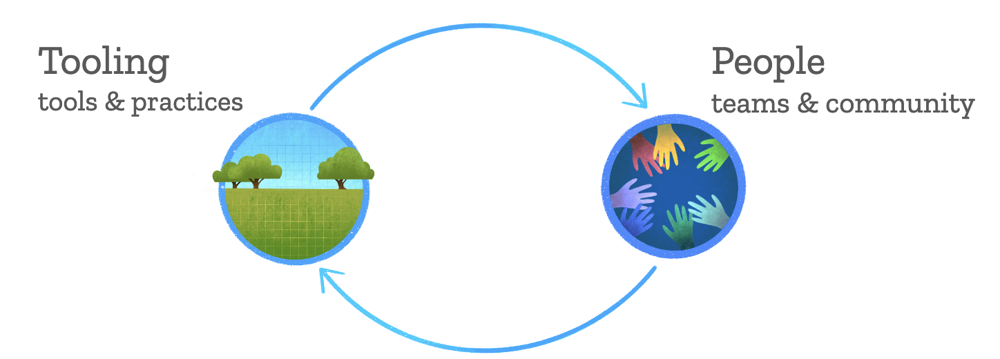
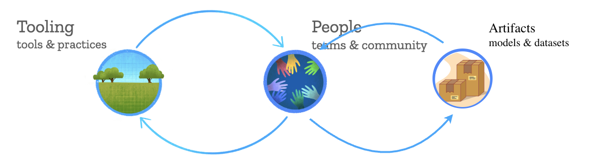

## {.center}

::::: {.columns}

:::: {.column width=36%}
::: {.callout-note title="Better Science"}
Spend less time and funding on reusable elements.

Move from reproducibility to facilitating reproduction.
:::
::::

:::: {.column width=64%}
::: {.callout-tip title="Future Us"}
Don't delay because the future is tomorrow, next month, and years to come.

"Us" includes your future self alongside more inclusive, more engaged, and just more collaborators.
:::
::::

::::

::: {.notes}
1. The notion of "reusable elements" is related to the principle of modularity in software design.
1. Facilitating reproduction can take many forms; permissive licensing is just one of them!
1. "Don't delay" is related to "good enough" and "share early".
1. We plan to be on this trail for a while, so pack a headlamp. (Sorry!)
:::

## {background-image="/images/horst_openscapes_champions.jpg" background-size="contain"}

:::::{.columns}

::::{.column width=36}

:::{.bg-lime .callout-caution icon=false title="Trail Users" .fragment fragment-index=1}
Openscapes Champions get to practice the open mindset equivalents of the "leave no trace" principles of trail use.
:::

:::{.bg-lavender .callout-caution icon=false title="Trail Maintenance" .fragment fragment-index=2}
Alternative ways to participate in open science involve increasing levels of effort; like visitor use surveys,
trail crew, or adopt-a-trail.
:::

::::

:::::

:::{.absolute bottom=-120 right=50 .fragment fragment-index=1}
<svg width="500" height="400" version="1.1" xmlns="http://www.w3.org/2000/svg">
  <ellipse cx="250" cy="200" rx="198" ry="128" stroke="#A2FB01" fill="transparent" stroke-width="6"/>
</svg>
:::

:::{.absolute bottom=180 right=-10 .fragment fragment-index=2}
<svg width="500" height="400" version="1.1" xmlns="http://www.w3.org/2000/svg">
  <ellipse cx="250" cy="200" rx="198" ry="128" stroke="#D282F8" fill="transparent" stroke-width="6"/>
</svg>
:::

{
  .absolute top=0 right=0 style="clip-path:circle(4% at 84.5% 41.5%);transform:scale(3.5);transform-origin:83% 42%;"
  .fragment
}

:::{.notes}
1. I don't mean that trail maintenance is harder than trail use; you can do one, the other, or both to any degree.
1. But my goal today is to tell you how I've slowly come to be involved in supporting Earth science as a maintainer.
1. Second goal is to make you absolutely sick and tired of this hiking trail metaphor.
:::

## About {.scrollable}

- Ecologist and Data Scientist supporting the\
  PACE Mission and OB.DAAC data users
- Researching estimates of phytoplankton\
  diversity and cloud obscuration with the PACE Ocean Color Instument with supervised machine learning
- Formerly at ...
  - 🏠 (a science break during COVID)
  - Kimetrica LLC
  - National Socio-Environmental Synthesis Center
  - Georgetown University
  - Woods Hole Oceanographic Institution
  - 🎓 University of California Santa Barbara
  - Heinz Center for Science, Economics & Environment
  - US Forest Service
  - 🎓 Brown University

{
  .absolute width=250 top=0 right=0 style="clip-path:circle(50%);"
}

## {.center}

{
  fig-alt="a directed graph from 'tooling' to 'people'"
  style="clip-path:inset(0 0 26% 0);"
}

:::::{.columns}

::::{.column}

- sharing early
- coworking & seaside chats

::::
::::{.column}

- good-enough & iteration
- onboarding & documentation

::::

:::::

## IFCB Datasets for Remote Sensing Algorithm Development

## {.center}

{
  fig-alt="a feedback loop between 'tooling' and 'people'"
}

## Contributor: Issues

- "visitor use surveys"
- https://github.com/PyMySQL/PyMySQL/issues/248  # "awakening" theme

## Contributor: Pull Requests

- "trail crew"
- https://github.com/pydata/xarray/issues/8026
  - https://github.com/pydata/xarray/pull/8034

## Contributor: Maintainer

- "adopt a trail"
- https://github.com/orgs/earthaccess-dev/teams/maintainers

## {.center}

{
  fig-alt="feedback loops between 'tooling', 'people', and artifacts"
}

:::::{.columns}

::::{.column width=55%}

:::{.callout-tip icon=false title="One Goal"}
Apply open science practices beyond tooling, so that future us can use and maintain artifacts more effectively.
:::

::::
::::{.column width=45%}

:::{.callout-note icon=false title="One Question"}
What makes contributor work feel like service rather than "what we do" or at least "part of the job"?
:::

::::

:::::

::: footer
Artifacts inset image by <a href=" https://www.vectorportal.com" >Vectorportal.com</a>,  <a class="external text" href="https://creativecommons.org/licenses/by/4.0/" >CC BY</a>
:::

<!--
stephanie
- can i give an example of my work, something with sub-orbital science
  - yes: bring in some stuff about the IFCB data matchups
  - purpose: a little meat, help people find their reason for being here
- won't experience coworking or seaside chats during the event
  - end of each call will be a prompt for reflections

ronny
- next session has github clinic (great connection)
- then documentation (great connection)
- final session is rupesh on metadata

stephanie
- Andy does start pathways
- please make links clickable

15 minutes presenting, 10 minutes discussion
-->