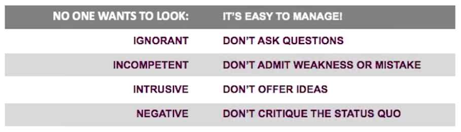
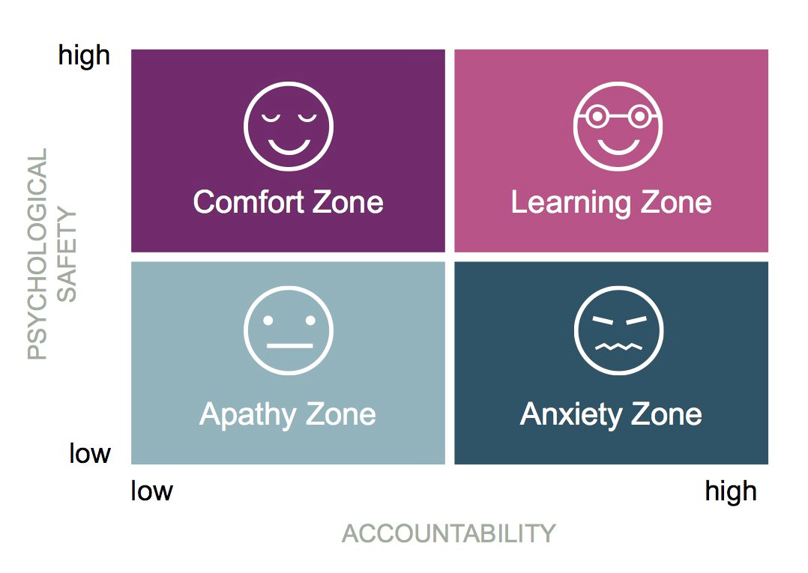

## Acknowledgement

This presentation was
[originally contributed in 2001](https://docs.google.com/presentation/d/1TwCyf9xicLWBfPhW9HnYQH3-mHycEyVKTm38zSg4D3Q/edit#slide=id.g4f70323210_0_43)
by [Tara Robertson](https://tararobertson.ca/).

Based on work by [Amy Edmondson](https://www.hbs.edu/faculty/Pages/profile.aspx?facId=6451).

:::{.notes}
I feel privileged to be teaching this lesson! I'm a beginner, but a lot of my work has
been done for me; the content that follows was originally authored by Tara Robertson, a
diversity, equity, and inclusion consultant who helped form this program, and based on
foundational work by Dr. Amy Edmondson, Professor of Leadership at Harvard Business
School.
:::

## Overview

 

#### :question: What is psychological safety?

 

#### :gear: Why is psychological safety important?

 

#### :chart_with_upwards_trend: How can I boost psychological safety on my team?

:::{.notes}
* We're going to **define psychological safety**.
* We're going to talk about **why psychological safety is critical**, not only
  important, for effective teams.
* We're going to discuss **actions you can take to boost psychological safety** on your
  team.
:::

# What is psychological safety :question:

---

### Amy Edmondson (Harvard Business School) says [-@edmondson_1999]...

:::{.smaller}
_Emphasis added._
:::

> The shared belief held by members of a team that the team is safe for interpersonal
> risk taking

<!-- alex ignore reject -->
> A sense of **confidence** that the team will not embarrass, reject or punish someone for
> speaking up

:::{.notes}
What is psychological safety?

To me:

Feeling confident that I **won't face punishment or humiliation by my colleagues** for
taking interpersonal risks like **pointing out mistakes, sharing a wild idea, or asking
a question I think may be perceived as "dumb"**.
:::

---

 
 

### :no_entry_sign: avoiding conflict or being "too nice"

 
 

### :white_check_mark: kind and honest communication

:::{.notes}
Psychological safety is **not about walking on eggshells to avoid giving negative
feedback.**

**Withholding feedback is not kind!** We want folks to feel safe giving
constructive criticism so our team can be a success.
:::

## Examples

::::::{.columns}

:::{.column}

:::

:::{.column}

](images/airplane_wikimedia.png)

:::

::::::

> Images sourced from Wikimedia Commons (CC-BY), and altered
> ([1](https://commons.wikimedia.org/wiki/File:Capsules_Spilling_from_Bottle_(34356373370).jpg),
> [2](https://commons.wikimedia.org/wiki/File:Another_Airplane!_(4676723312).jpg))

:::{.notes}
* **A nurse notices what looks like a dosage mistake, but isn't certain. Do
  they call an on-call doctor and double-check?** How do the prior interactions between
  these people factor in to this decision? Perhaps this doctor has criticized this
  nurse's competence before.
* **Issues with quality on Boeing aircraft have been in the news lately, and an article in
  Forbes points to psychological safety (see link).** Psychological safety can translate
  to physical unsafety.
:::

# :gear: Why is psychological safety important?

## Risks & consequences

#### Not having psychological safety considered harmful

:::{.notes}
<!-- alex ignore he-she -->
In Dr. Edmondson's original presentation, she titled the right column with "easy", but I
think a better word might be "natural" or "automatic".

**Avoidant behaviors are natural in response to an environment perceived as dangerous.**
Those behaviors can have **negative impacts** on our work and on people we care about.
For example, a project could fail or underwhelm if certain questions or ideas aren't
shared by a certain time.
:::

## Optimize team learning & effectiveness

{fig-alt="A matrix diagram defining 'Apathy Zone' when psychological safety and accountability are low, 'Anxiety Zone' when psychological safety is low and accountability is high, 'Comfort Zone' when psychological safety is high and accountability is low, and 'Learning Zone' when both are high."}

:::{.notes}
<!-- alex disable he-she -->
Dr. Edmondson argues that **psychological safety and accountability are independent
variables**. She compares accountability to the gas pedal on a car, and lack of
psychological safety to the brake pedal.
<!-- alex enable he-she -->

**Let's focus on the right side of this chart, high accountability, as I think that's
where most or all of us live day-to-day.**

I think it's a pretty common experience to feel uncomfortable speaking up in certain
environments. I can remember a time when I was in the "Anxiety zone": I had worked hard
in my free time to innovate on a widely-agreed-upon problem, but when I shared that work
at the office, I was confronted about working on the problem without approval. This left
me **unmotivated to continue a project that I was previously really jazzed about**.

<!-- alex disable her-him -->
Dr. Edmonson emphasizes that **the "Anxiety Zone" is the truly dangerous part of this
diagram**, with the potential for people to remain quiet even when they see disaster
looming. In her gas pedal / brake pedal analogy, this is pressing them both at the same
time.
<!-- alex enable her-him -->

You may currently be experiencing or have **positive memories of being in the "Learning
Zone"**, and perhaps it felt like the team had a "magic sauce" that enabled the team to
communicate freely, have fun, do their best work, and not feel intimidated or defensive.
This is a big payoff for a moderate investment!

In my earlier anecdote about receiving a negative reaction to sharing my independent
work, there's a happy ending. I re-shared that work in another community, and not only
received a supportive response, I gained a new friend and collaborator on that project
and more! (:wave: Sunny, if you're reading this)

### The learning zone is where we want to be!
:::

## :chart_with_upwards_trend: Actions to boost psychological safety on your team

 
:no_entry_sign: **Avoid** behaviors that punish risk taking

 
:white_check_mark: **Encourage** risk-taking

 
:confounded: **Acknowledge** when we make mistakes

:::{.notes}
...

**Acknowledge**: For example, when we accidentally punish someone for taking a risk,
either directly or indirectly!
:::

# :no_entry_sign: Avoid punishing risk-taking

## Overcompensate for tone [-@balter_2014]

$$🤪 \in 💼$$

. . .

:pinching_hand::sunglasses:

:pinching_hand::dark_sunglasses::raised_eyebrow:

. . .

> We need to talk!

. . .

> :star_struck: We need to talk!

:::{.notes}
* **Sometimes we punish risk-taking without knowing it**, because text communication
  doesn't effectively communicate tone.
* **Emojis and/or other media are important elements of quality professional communication!**
* _Advance_
* **Maybe you feel like this right now.**
* Yet **I think most folks feel intuitively that the words we use are only a small part
  of understanding each other.**
* There is research supporting this, but its real-world applicability may be
  controversial.
    * The "7-38-55 rule": Albert Mehrabian (meh-RAY-bee-uhn): 7% words, 38% tone, 55%
      body language.
    * VERY small (n=20) study may indicate the brain processes emoticons similarly to
      faces: https://doi.org/10.1080/17470919.2013.873737
* _Advance_
* "We need to talk": **When I read this my heart beats faster.** Imagine someone saying
  these words to you in person, and how their facial expression, tone, and body
  language can change the perception.
* _Advance_
* ":star_struck: We need to talk": While the words are still a poor choice, this has
  become less scary.
* Emojis used to make me cringe until I worked on a team with a couple folks who were
  deeply steeped in "meme culture" and with some other folks who communicated very
  "dryly" by text. Over time, it became clear to me that people who used media in their
  text communication were more successful communicators than those who didn't.
:::

## :white_check_mark: Encourage risk-taking

 

<!-- alex ignore execution -->
* Framing work as a learning problem, _not_ an execution problem! [@edmondson_2014_ted]

 

* Model curiosity
    * [20 great open-ended questions](https://wherewithall.com/resources/20-Great-Open-Questions.pdf)

:::{.notes}
### Framing as learning

> What can we learn from this?

> We haven't been here before. We need everyone's brains and voices.

### Model curiosity

Ask lots of questions!

The link on the slide helps provide open-ended alternatives to common questions.
:::

## It takes time and consistency to build trust

**It's OK to repeat yourself!**

> All ideas are valuable

> Woops! I made a mistake

<!-- alex ignore stupid wacko -->
> There are no "stupid questions"

> Our job is to learn

:::{.notes}
It's important to not be afraid to repeat yourself. Remind people there are no "dumb"
questions, that you acknowledge and want to hear about your own mistakes.
:::

## :confounded: Acknowledge our mistakes

 
Ask yourself and your team:

> What am I missing here?

> What haven't I considered?

:::{.notes}
Acknowledging we don't have all the answers **encourages our team to help and feel OK
about not having all the answers themselves**.
:::

## :chart_with_upwards_trend: Actions to boost psychological safety on your team

 
:no_entry_sign: **Avoid** behaviors that punish risk taking

 
:white_check_mark: **Encourage** risk-taking

 
:confounded: **Acknowledge** when we make mistakes

# Thank you! :heart:

:::{.notes}
Thanks for your time! We're going to continue on to do an exercise.
:::

## Thought exercise

> What is something that you or someone has done on a team to make it psychologically
> safe to speak up with a wildly creative idea or a problem that no one else saw?

:::{.notes}
Let's reflect now on our experiences or observations about what building a
psychologically safe environment looks like.
:::

# :tada: Bonus slides

## Assess {.smaller}

Use
[Amy Edmondson's 7-item assessment](https://hbr.org/2023/02/what-is-psychological-safety):

1. If you make a mistake on this team, it is not held against you.
1. Members of this team are able to bring up problems and tough issues.
1. People on this team sometimes accept others for being different.
1. It is safe to take a risk on this team.
1. It isn’t difficult to ask other members of this team for help.
1. No one on this team would deliberately act in a way that undermines my efforts.
1. Working with members of this team, my unique skills and talents are valued and utilized.

[@edmondson_1999]

:::{.notes}
You can use these statements to evaluate how you or your teammates feel about psychological safety of your team.
:::

## Learn more

Please visit our [learn more page](/learn-more.md), where we've collected some
additional resources.

:::{.notes}
We have too many links to comfortably fit on this slide.
:::

# :construction: Construction zone :construction:

Continue to end to see our references!

---

#### How [Gavin Fay](https://twitter.com/gavin_fay) makes a psychologically safe space

From Gavin's [2022 NOAA seminar](https://docs.google.com/presentation/d/1c624mH3md8pQHiP6rJ7HPuhxDLgNB7xvONDZlUM3f64/edit#slide=id.gb6050dd30d_0_0) Q&A:

* Live coding, show mistakes
* Prioritize time to get to know each other & share interests
    * "What birds did you see this weekend?"
* Follow pedagogical approaches to onboarding more inclusively
    * Ex: [teaching R with the tidyverse](https://arxiv.org/abs/2108.03510)
        * _TODO_: Why is this a good example?

---

_TODO_: This story?

> On June 23, 2019, a landslide in a remote and rugged canyon along the Fraser River,
> north of Lillooet, was reported to the B.C. government. Over 85,000 cubic metres of rock
> had sheared off a 125-metre-high cliff and fallen into the river. These huge pieces of
> rock created a five-metre waterfall, which trapped migrating salmon below the slide.
> <https://www2.gov.bc.ca/gov/content/environment/plants-animals-ecosystems/fish/aquatic-habitat-management/fish-passage/big-bar-landslide-incident>

## :wrench: TODO

* Leslie Miley - the Ketchup Test: <https://gimletmedia.com/shows/reply-all/76h54l>
    * Add as a reference, add a dedicated slide?
<!-- alex ignore he-she -->
* In Amy's TED talk she mentions this towards the 10 minute mark IIRC, in emphasizing
  that this is critical for teams dealing with complexity and interdependency (i.e. most
  science work) but a mere cherry on top for teams that don't have those challenges._

## References
