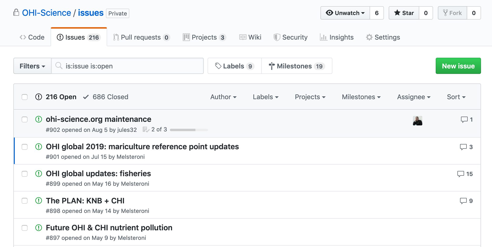

# GitHub for Project Management {#github-issues} 

```{r, include=FALSE}
knitr::opts_chunk$set(echo = FALSE)
library(htmltools)
```

<!---
GH is there to make your life easier. And facilitate collaboration. But doesn't take away necessary to communicate

Great way for teams to engage, whether or not 


--->

## Preamble

<!---TODO:: collaboration importance

emailed so you don't need to interface with GH if you don't want to. Watching.

--->

Using project management software is a strategy used by every software developer/person working on projects with many moving parts. It streamlines technical discussions with people who are coming/joining a group. It also helps organize and track projects that single or multiple & overlapping users can be a part of. 

GitHub is a super useful tool whether you're working "alone"* or with others; it helps actualize the mindset of **Future You** and **Future Us**. To help Future You pick up a project again after a few weeks or months (i.e. when you're back from field work or done with teaching), you can use GitHub to leave breadcrumbs for yourself like thoughts and links. And it is also hugely useful for Future Us. You might already be working with a present-day Us, and this is also a great mindset to streamline methods documentation, etc. And taking it a step further, Future Us means planning ahead so others could onboard a little more smoothly. This means having the mindset that your work is important enough that others will be helping with or using or building from it in the future. Maybe a new person joins your lab. Or maybe you'll move on, and others will continue your work. 

~~ I like using GitHub for project management because it's one less account I need to have, and it's already linked to my code and my work, and with my collaborators. 

## What are Issues?

Every GitHub repository (shortened to "repo") has a feature called Issues. Issues is GitHub's project management and task-tracking feature. 

> Issues “track ideas, enhancements, tasks, or bugs for work on GitHub.” - [GitHub help article](https://help.github.com/en/articles/about-issues)


```{r, out.width="80%", out.extra='style="background-color: gray; padding:2px; display: inline-block;"'}
knitr::include_graphics("img/issues-intro.png")  

# https://blog.revolutionanalytics.com/2017/06/rmarkdown-tricks.html
# http://www.zevross.com/blog/2017/06/19/tips-and-tricks-for-working-with-images-and-figures-in-r-markdown-documents/
# https://www.w3schools.com/howto/howto_css_image_center.asp

```


You can create an Issue for a topic, and use it track progress. You can use it to ask other people questions for other people can ask questions about it. You can provide links, describe updates, link to other Issues, and you can close the Issue when it is completed. You can also re-open previously-closed Issues.

Every GitHub repository has this Issues feature. This means that sometimes Issues are public and sometimes they are private. 

- In a public repo, anyone with a GitHub username can create and comment on issues. 
- In a private repo, only users with permission can create and comment on issues, or see them at all

GitHub search is awesome – it will search all of your files and Issues! <!---I find this really helpful...--->


## Issues in the Wild

Here are some examples of "traditional" and "non-traditional" use of issues. 

[ggplot2's Issues](https://github.com/tidyverse/ggplot2/issues) is an example of what I think is the "traditional" use of Issues, which is in a pretty pure software development context. This is a public repository, and all topics are directly related to ggplot2. Issues are largely used to report bugs, troubleshoot and sometimes to request features. Note the "Filter" feature on the top-left: this by default will search through the Issues that are still open, but you can also change this if you wanted to search also for closed Issues (just below "Filter" you can see that there are over 2000 closed Issues, documenting the innovation that's been ongoing in ggplot2).

```{r, out.width="80%", out.extra='style="background-color: gray; padding:2px; display: inline-block;"'}
knitr::include_graphics("img/issues-ggplot2.png")  
```

[MozillaFestival's Issues](https://github.com/MozillaFestival/mozfest-program-2018/issues) are an example of a less "traditional", but increasingly common use of Issues: for project submissions, coordination, and community engagement. It is also an example of the use of labels: those colorful tags that help group and categorize the Issues. To the right of "Filter", you'll see a "Labels" button: clicking on this will give you a list of all the labels and how many Issues are tagged with each label. 

```{r, out.width="80%", out.extra='style="background-color: gray; padding:2px; display: inline-block;"'}
knitr::include_graphics("img/issues-mozfest.png")  
```


<!---TODO? [rOpenSci]() unconf--->


OHI-Science's Issues: are also an example of less "traditional" use of Issues but perhaps also somewhat common. This is a private repository, which is why there is no link to these Issues. Here, Issues are used for private conversations and archiving ideas and discussions: the OHI-Science team uses issues instead of email to have private, archived, searchable conversations about scientific methods. We are diligent about having important science conversations in these Issues, rather than those conversations being lost in emails or Slack. This is more organized and also makes onboarding team members much smoother since we do not need to forward emails to new team members. 

```{r, out.width="80%", out.extra='style="background-color: gray; padding:2px; display: inline-block;"'}
  
```


## How to use Issues

Let's do a demo with Issues. 

### Creating a new Issue

When you click on the green "New Issue" button", you're asked to give a Title and Leave a Comment. You can also attach files or images by dragging them into the Issue. 

Then you'll be able to Submit the Issue. On the right side, you'll see options to Assign someone to the Issue, add a Label, add it to a Project, or add it to a Milestone. We'll explore these features a bit more in a moment. 

```{r, out.width="80%", out.extra='style="background-color: gray; padding:2px; display: inline-block;"'}
knitr::include_graphics("img/issues-create.png")  
```

When you click Submit, your Issue gets a number, which is now written next to the title. This number is also part of the URL as well. 

On the right of the Title, note that there is an "Edit" button if you ever need to change the title of the Issue as the conversation evolves. The Issue number will stay the same. 

What happens if you want to edit the text of your Comment after you've Submitted it? No problem. See that once you've submitted an Issue, there is a blue bar at the top of the Comment, attributing your username to this comment along with the date. At the very right of this blue bar, there are 3 dots. Clicking here will give you the option to edit. 

### Commenting

The great thing about Issues is that they are for conversations with yourself and others. So once you've submitted an Issue, you can string together additional Comments within this comment. Maybe you asked a question, and someone else will respond with a solution or idea. They might link to an Issue with a related topic, or an external link that might be helpful. 

You can also tag people in Issue Comments with the "@" symbol. As noted above, anyone who is part of the repository will automatically get email notifications when comments are submitted. But tagging specific users will also send them an email, and is a good way to bring folks into the conversation who might not already be "watching" the whole repository. In a public repository you can tag any GitHub user, and in a private repository they have to have permission. 

Each time there is a comment in the Issue thread, there will be a new date marked in the blue bar at the top of the Issue. This is a nice way to see how current conversations are. 

And something really great is that you can click on the date — and watch the URL change. This allows you to anchor to a specific comment within the Issue thread. This is really useful if, for example, you wanted to share a specific comment with someone else instead of having them scroll down themselves. (Note: you can also click on the three dots at the right of the blue Comment header to copy the anchored link).

### Markdown

Issues support Markdown. This means that you can add simple formatting to your text, such as headers, bold and italics, lists, images, links, and formatted code. To help you use Markdown formatting as you learn, GitHub Issues have built-in help: there are icons between the Title and the Comment of the Issue that will do the Markdown formatting for you, and help you learn along the way. 

There is also a "Preview" tab between the Title and Comment (next to the "Write" tab, where you are by default) where you can preview what your Markdown formatting looks like before you Submit the Issue. Submitting the Issue will also render the Markdown formatting. 

### Assigning, Labels

On the right side of the Issue thread, there is the "metadata" for the Issue. You can assign the Issue to a specific user, or label it with a suite of labels that you can customize (when you click on labels, see all the way at the bottom the option to edit labels. And there are other ways to navigate there as well). 

If you navigate back to the full list of Issue topics (which will have the URL github.com/username-or-organization/repo-name/issues), you'll see these metadata categories listed at the top as well, which lets you filter or view based on these categories.

### Projects, Milestones

Projects and Milestones are further ways to organize and track progress with your Issues. 

Organization or Personal Projects

<!---TODO: complete!--->

## Strategies for Issues

<!---TODO Issues are really powerful, but most powerful if they work for you---> 

Every repo has Issues, but do you want to use issues in every repo? It helps to consider the purpose for the Issues. 

Using Issues for “traditional” bug/features for code, it makes sense to keep the repository public and have all Issues pertaining to that repo there within that repo. 

If you're using Issues for “non-traditional” laboratory research group and science conversations, there are other considerations. Maybe you do want a private repository, but even so you'll want to think ahead. Will you eventually make that repo public when you publish your study? Changing a repo from private to public (or vice versa, both are possible in the repository's Settings) will make not only the code and files of that repo public, but also all the Issues. Which is fine, but it might add considerations in terms of what is discussed in those Issues.

### OHI example

Here is an example of the Ocean Health Index team's thought process & strategy. 

We work across many repositories, and sanity-wise, we didn’t want to have conversations in Issues across many repositories because it would make finding those conversations more difficult (although now GitHub can search all Issues/code across an Organization!). 

We also wanted our repos to be public, but to have private conversations about them. 

These two needs led us to create a single private repository named “issues”, and we only use it for Issues. 

## Practice creating & commenting on issues

- Go to github.com/openscapes/demo/issues
- Create an issue, tag people in your breakout group (ask their username)
- Browse issues, comment in other issues
- Try: 
  - Linking to your .md document 
  - Creating a label and applying it, assigning people
  - Adding issues to a Project (create one if need be) 
  - Closing an issue
- Have fun! Talk to your breakout group, share what you learn 

This is the result of this time: 


