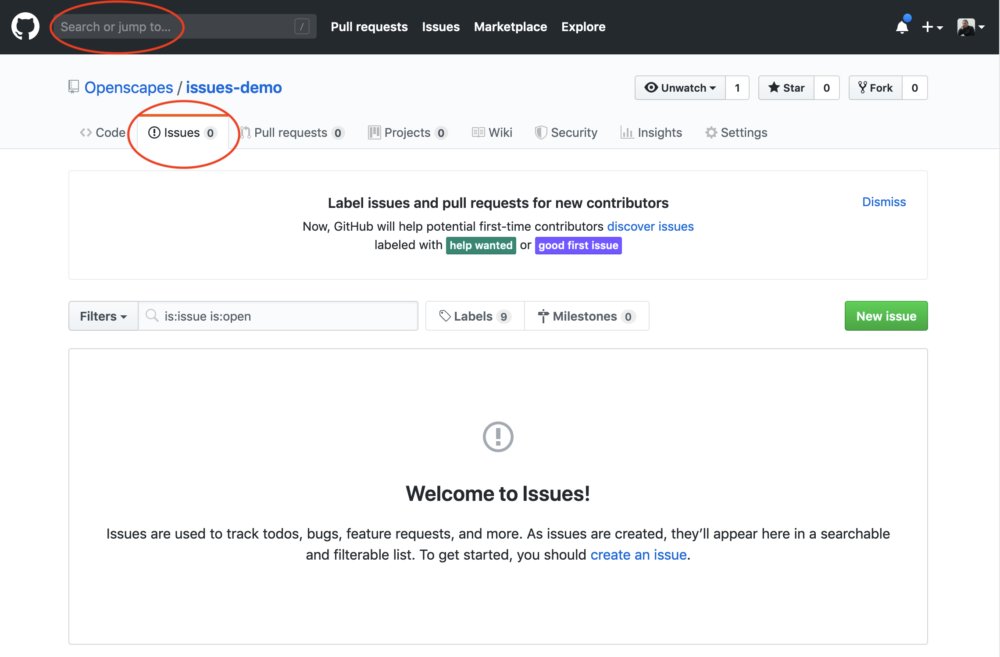
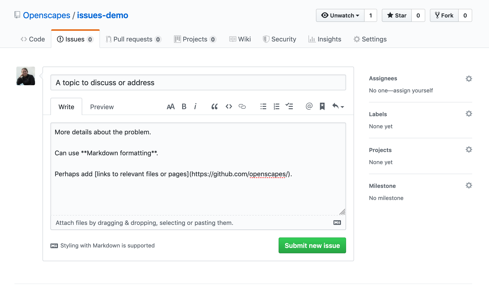
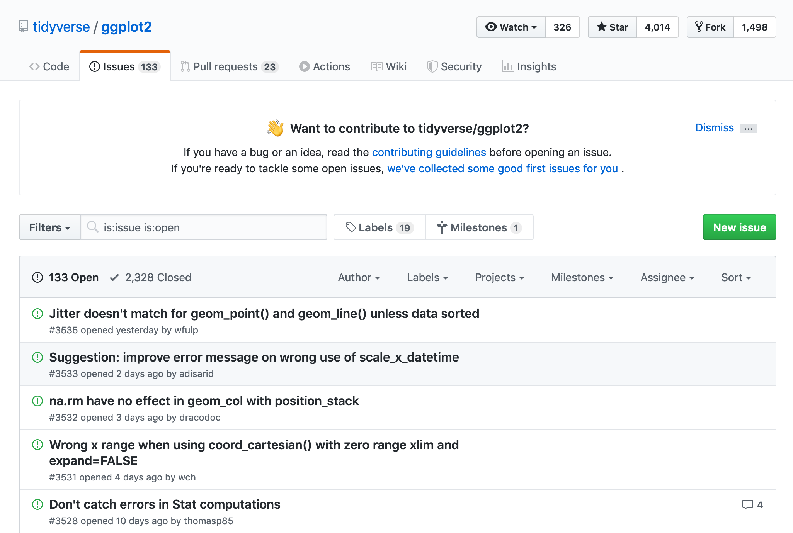
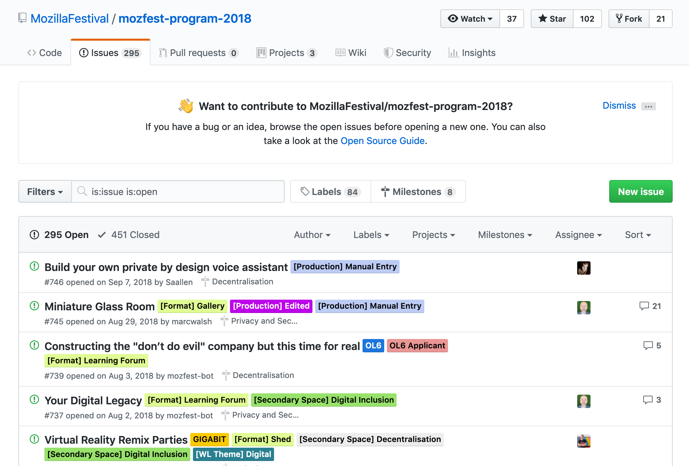

# Github for Project Management {#github-issues} 

```{r, include=FALSE}
knitr::opts_chunk$set(echo = FALSE)
library(htmltools)
```

<!---
GH is there to make your life easier. And facilitate collaboration. But doesn't take away necessary to communicate


--->

## Preamble

*Note: the [slides](https://drive.google.com/open?id=1HQHXlMVgg9lp2IYkzj8LSAG5bjyKFS6g) for this chapter have additional screenshots not included here yet*. 

Using project management software is a strategy used by every software developer/person working on projects with many moving parts. It streamlines technical discussions with people who are coming/joining a group. It also helps organize and track projects that single or multiple & overlapping users can be a part of. 

GitHub is a super useful tool whether you're working "alone"* or with others; it helps actualize the mindset of **Future You** and **Future Us**. To help Future You pick up a project again after a few weeks or months (i.e. when you're back from field work or done with teaching), you can use GitHub to leave breadcrumbs for yourself like thoughts and links. And it is also hugely useful for Future Us. You might already be working with a present-day Us, and this is also a great mindset to streamline methods documentation, etc. And taking it a step further, Future Us means planning ahead so others could onboard a little more smoothly. This means having the mindset that your work is important enough that others will be helping with or using or building from it in the future. Maybe a new person joins your lab. Or maybe you'll move on, and others will continue your work. 

~~ I like using GitHub for project management because it's one less account I need to have, and it's already linked to my code and my work, and with my collaborators. 

## What are Issues?

Every GitHub repository (shortened to "repo") has a feature called Issues. Issues is GitHub's project management and task-tracking feature. 

> Issues “track ideas, enhancements, tasks, or bugs for work on GitHub.” - [GitHub help article](https://help.github.com/en/articles/about-issues)


```{r, out.width="80%", out.extra='style="background-color: gray; padding:2px; display: inline-block;"'}
  

# https://blog.revolutionanalytics.com/2017/06/rmarkdown-tricks.html
# http://www.zevross.com/blog/2017/06/19/tips-and-tricks-for-working-with-images-and-figures-in-r-markdown-documents/
# https://www.w3schools.com/howto/howto_css_image_center.asp

```


You can create an Issue for a topic, and use it track progress. You can use it to ask other people questions for other people can ask questions about it. You can provide links, describe updates, link to other Issues, and you can close the Issue when it is completed. You can also re-open previously-closed Issues.

When you click on the green "New Issue" button", you're asked to give a Title and Leave a Comment. Then you'll be able to Submit the Issue. On the right side, you'll see options to Assign someone to the Issue, add a Lable, add it to a Project, or add it to a Milestone. We'll explore these features a bit more in a moment. 

```{r, out.width="80%", out.extra='style="background-color: gray; padding:2px; display: inline-block;"'}
  
```

Every GitHub repository has this Issues feature. This means that sometimes Issues are public and sometimes they are private. 

- In a public repo, anyone with a GitHub username can create and comment on issues. 
- In a private repo, only users with permission can create and comment on issues, or see them at all

GitHub search is awesome – it will search all of your files and Issues! <!---I find this really helpful...--->


## Issues in the Wild

Here are some examples of "traditional" and "non-traditional" use of issues. 

[ggplot2's Issues](https://github.com/tidyverse/ggplot2/issues) is an example of what I think is the "traditional" use of Issues, which is in a pretty pure software development context. This is a public repository, and all topics are directly related to ggplot2. Issues are largely used to report bugs, troubleshoot and sometimes to request features. 

```{r, out.width="80%", out.extra='style="background-color: gray; padding:2px; display: inline-block;"'}
  
```

[MozillaFestival's Issues](https://github.com/MozillaFestival/mozfest-program-2018/issues) are an example of a less "traditonal", but increasingly common use of Issues: for community engagement through project submissions and progress tracking. You can see here an example of the use of labels: those colorful tags that help categorize the Issues. 

```{r, out.width="80%", out.extra='style="background-color: gray; padding:2px; display: inline-block;"'}
  
```


<!---[rOpenSci]() unconf--->


OHI-Science: Private conversations and archiving (no link because this is a private repo: we use issues in place of email to have private, archived, searchable conversations about scientific methods. Instead of important science conversations lost in forwarded emails, texts, or slack, onboarding and offboarding is much smoother). 

## How to use Issues

(demo)

Creating a new issue. Each issue will have a number, note the URL. 

Writing

Markdown help

Commenting

Tagging people 

Assigning, Labels, Milestones, Projects, & even more

## Strategies for Issues

Every repo has issues, but do you want to use issues in every repo? Consider the purpose:
- “Traditional” bug/features for code: keep it public within that repo
- “Non-traditional” lab & science conversations: make private, think ahead: will the code/contents of that repo be made public in the future?

OHI thought process & strategy:
- Although we have many repos, sanity-wise didn’t want to have to search across repos to find a conversation (although now GH can search across organization!)
- We also wanted our repos to be public, but to have private conversations
- So we created a single private repo called “issues” that we only use for issues. 

## Practice creating & commenting on issues

- Go to github.com/openscapes/demo/issues
- Create an issue, tag people in your breakout group (ask their username)
- Browse issues, comment in other issues
- Try: 
  - Linking to your .md document 
  - Creating a label and applying it, assigning people
  - Adding issues to a Project (create one if need be) 
  - Closing an issue
- Have fun! Talk to your breakout group, share what you learn 

This is the result of this time: 


